# Installing ArgoCD 


Installing ArgoCD is very straightforward, you can use both helm charts or apply yaml file. 

We use yaml file to install ArgoCD in our kubernetes cluster.

I suggest utilizing [Kind](https://kind.sigs.k8s.io/docs/user/quick-start/) to establish your Kubernetes cluster and then installing ArgoCD onto it.

## install kubernetes cluster with kind

I highly recommend read kind documentation for you test environment, you can setup multi-node kubernetes cluster in a few seconds and do your tests on this cluster.


I will setup 3-node kubernetes cluster.
here the configuration of kind 

crate a file call it `workernodes.yaml` and insert below content into this file


```

# kind.yaml
kind: Cluster
apiVersion: kind.x-k8s.io/v1alpha4
nodes:
- role: control-plane
  kubeadmConfigPatches:
  - |
    kind: InitConfiguration
    nodeRegistration:
      kubeletExtraArgs:
        node-labels: "ingress-ready=true"
  extraPortMappings:
  - containerPort: 80
    hostPort: 80
    protocol: TCP
  - containerPort: 443
    hostPort: 443
    protocol: TCP

- role: worker
- role: worker

```

save and exit, then run the following command to setup the cluster

```
kind create cluster --config workernodes.yaml

```

after a few seconds, we have a kubernetes cluster with 3 nodes.


`Please note that you need to install the 'kubectl' binary.`

```

kubectl get nodes 

NAME                 STATUS   ROLES           AGE    VERSION
kind-control-plane   Ready    control-plane   110m   v1.27.1
kind-worker          Ready    <none>          110m   v1.27.1
kind-worker2         Ready    <none>          110m   v1.27.1

```

## Install ArgoCD

Go to the ArgoCD documentation for [quick setup instructions](https://argo-cd.readthedocs.io/en/stable/getting_started/)

run the following command for setup ArgoCD

```

kubectl create namespace argocd
wget https://raw.githubusercontent.com/argoproj/argo-cd/stable/manifests/install.yaml
kubectl apply -n argocd -f install.yaml

kubectl get pod -n argocd 


NAME                                                READY   STATUS              RESTARTS   AGE
argocd-application-controller-0                     0/1     ContainerCreating   0          32s
argocd-applicationset-controller-698ff59586-jh2vl   0/1     ContainerCreating   0          33s
argocd-dex-server-c8dfd59bb-trk5l                   0/1     Init:0/1            0          33s
argocd-notifications-controller-65d7bfc89c-v9jg4    0/1     ContainerCreating   0          33s
argocd-redis-77bf5b886-9t6kx                        0/1     ContainerCreating   0          33s
argocd-repo-server-dd9f854ff-6lc2b                  0/1     Init:0/1            0          33s
argocd-server-54747d4484-gzgdn                      0/1     ContainerCreating   0          32s


```

You can monitor the status of pods in the "ContainerCreating" state and wait a few seconds for all containers to finish pulling.

``` 

kubectl get pod -n argocd

NAME                                                READY   STATUS    RESTARTS   AGE
argocd-application-controller-0                     1/1     Running   0          9m44s
argocd-applicationset-controller-698ff59586-jh2vl   1/1     Running   0          9m45s
argocd-dex-server-c8dfd59bb-trk5l                   1/1     Running   0          9m45s
argocd-notifications-controller-65d7bfc89c-v9jg4    1/1     Running   0          9m45s
argocd-redis-77bf5b886-9t6kx                        1/1     Running   0          9m45s
argocd-repo-server-dd9f854ff-6lc2b                  1/1     Running   0          9m45s
argocd-server-54747d4484-gzgdn                      1/1     Running   0          9m44s


kubectl get svc -n argocd 
NAME                                      TYPE        CLUSTER-IP      EXTERNAL-IP   PORT(S)                      AGE
argocd-applicationset-controller          ClusterIP   10.96.63.240    <none>        7000/TCP,8080/TCP            14m
argocd-dex-server                         ClusterIP   10.96.104.98    <none>        5556/TCP,5557/TCP,5558/TCP   14m
argocd-metrics                            ClusterIP   10.96.94.167    <none>        8082/TCP                     14m
argocd-notifications-controller-metrics   ClusterIP   10.96.236.183   <none>        9001/TCP                     14m
argocd-redis                              ClusterIP   10.96.158.172   <none>        6379/TCP                     14m
argocd-repo-server                        ClusterIP   10.96.19.104    <none>        8081/TCP,8084/TCP            14m
argocd-server                             ClusterIP   10.96.103.42    <none>        80/TCP,443/TCP               14m
argocd-server-metrics                     ClusterIP   10.96.191.152   <none>        8083/TCP                     14m


kubectl get nodes -o wide
NAME                 STATUS   ROLES           AGE    VERSION   INTERNAL-IP
kind-control-plane   Ready    control-plane   177m   v1.27.1   172.20.0.2
kind-worker          Ready    <none>          176m   v1.27.1   172.20.0.3
kind-worker2         Ready    <none>          176m   v1.27.1   172.20.0.4


```

To access the ArgoCD UI, we have two options.

* Change the service to a NodePort type.
* Utilize an Ingress controller.

We have decided to choose the first option, which involves changing the service to a NodePort type.

``` 

kubectl -n argocd patch svc argocd-server -p '{"spec": {"type": "NodePort"}}'

```

now run the following command for finding the nodeport port for accessing the argocd ui: 

```

kubectl get svc -n argocd | grep -i nodeport

argocd-server                             NodePort    10.96.103.42    <none>        80:30162/TCP,443:32700/TCP   47m


```

attention to the following: 
`80:30162/TCP,443:32700/TCP   47m`


now open your favorite browser and go the the following address: 172.20.0.2:30162

`172.20.0.2` This IP address is actually the IP of your Kubernetes node, obtained from the following command.
```

kubectl get nodes -o wide

NAME                 STATUS   ROLES           AGE    VERSION   INTERNAL-IP
kind-control-plane   Ready    control-plane   177m   v1.27.1   172.20.0.2
kind-worker          Ready    <none>          176m   v1.27.1   172.20.0.3
kind-worker2         Ready    <none>          176m   v1.27.1   172.20.0.4


```

you have to see the argocd ui 
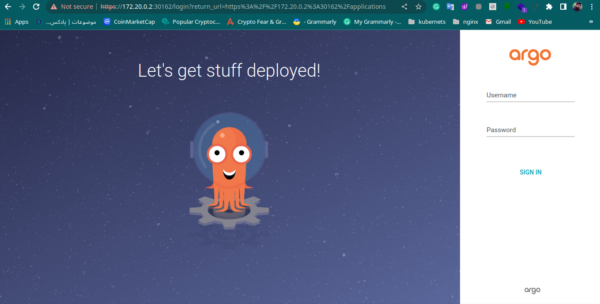


as the documentation, the default password for argocd is: `admin`.


and for obtain the password run below command:

```
kubectl get secrets -n argocd argocd-initial-admin-secret -o yaml | grep password

```

here is the result of above command: 

```
password: YUFpYm13UUtyQy1CczJiLQ==

```

To decode the password, execute the following command as it is base64 encoded:

```
echo "YUFpYm13UUtyQy1CczJiLQ==" | base64 -d

# This is the result: 
aAibmwQKrC-Bs2b-%

# your password is: 
aAibmwQKrC-Bs2b-
```

After login to the argocd ui, please change your password in the `User Info` section


## Setup a project


### add repository to the argocd

Before creating a project in ArgoCD, you need to add a repository that contains the YAML files for your applications.

go the the settings
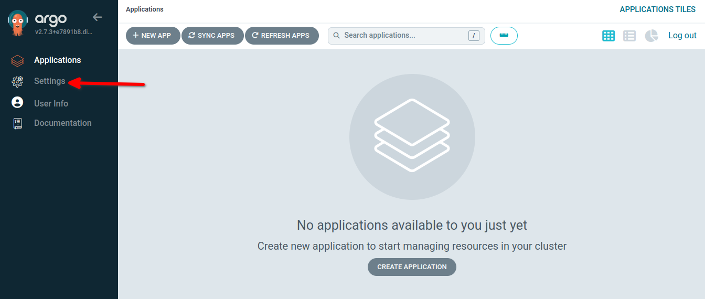

click the repository
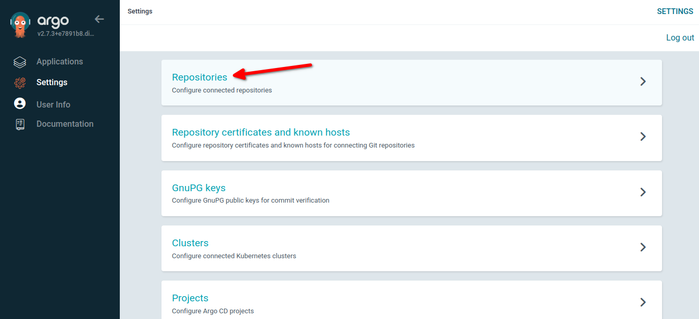

next click to `CONNECT REPO` 

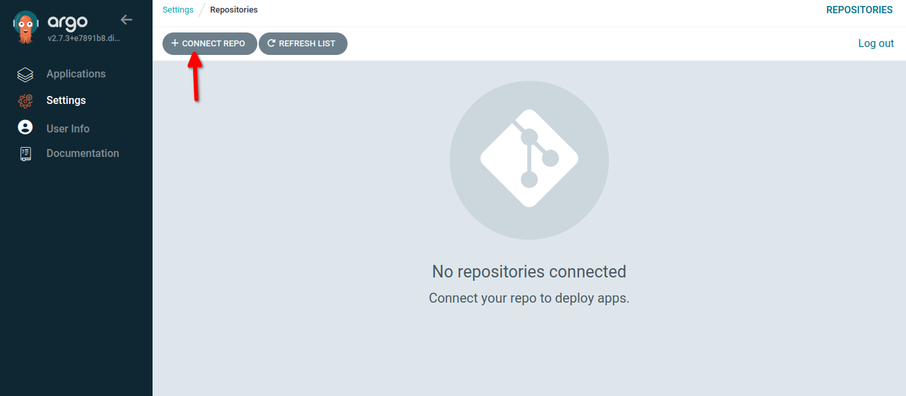

do the following thing
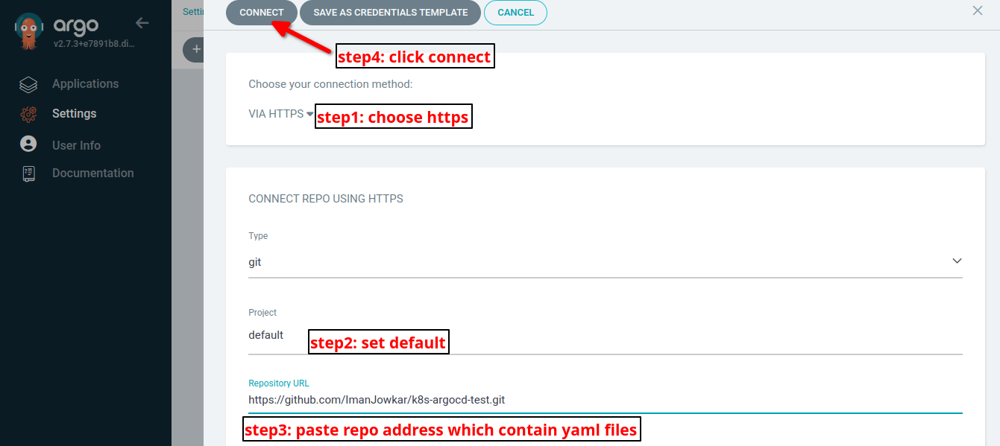

after these steps you have to see something like this: 
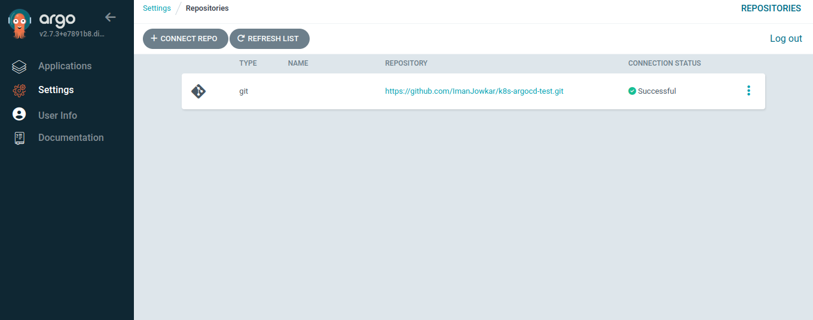


This [repository](https://github.com/ImanJowkar/k8s-argocd-test.git) consists of two YAML files: one for the deployment and the other for the service, both serving as samples.

here are the two YAML files

cat deploy.yaml
```
apiVersion: apps/v1
kind: Deployment
metadata:
  name: nginx-deployment
spec:
  selector:
    matchLabels:
      app: nginx
  replicas: 2 # tells deployment to run 2 pods matching the template
  template:
    metadata:
      labels:
        app: nginx
    spec:
      containers:
      - name: nginx
        image: nginx:1.14.2
        ports:
        - containerPort: 80

```
cat svc.yaml
```
apiVersion: v1
kind: Service
metadata:
  name: my-service
spec:
  type: NodePort
  selector:
    app: nginx
  ports:
    - protocol: TCP
      port: 80
      targetPort: 80

```


### Create a project

go to the Application and click `NEW APP` 


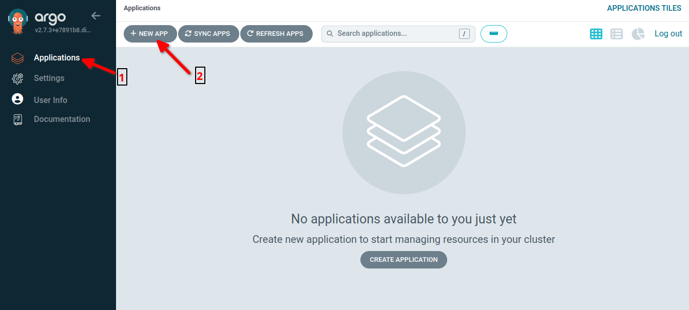

do the following
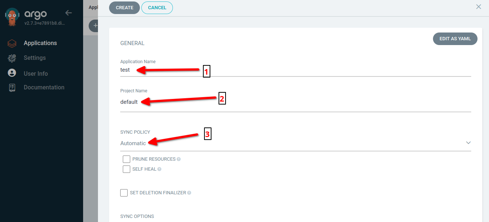
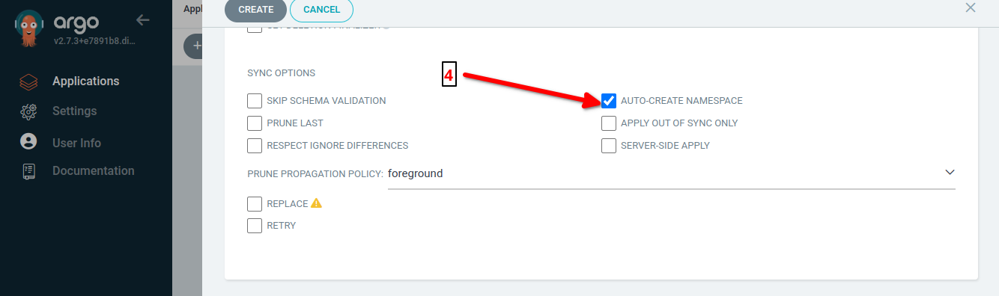
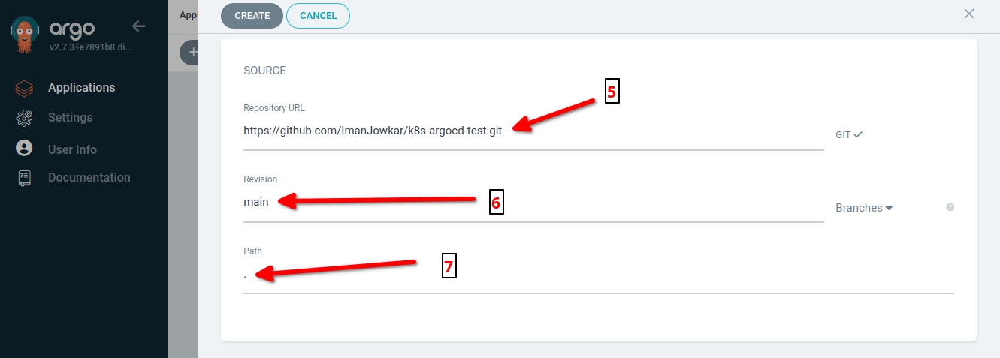
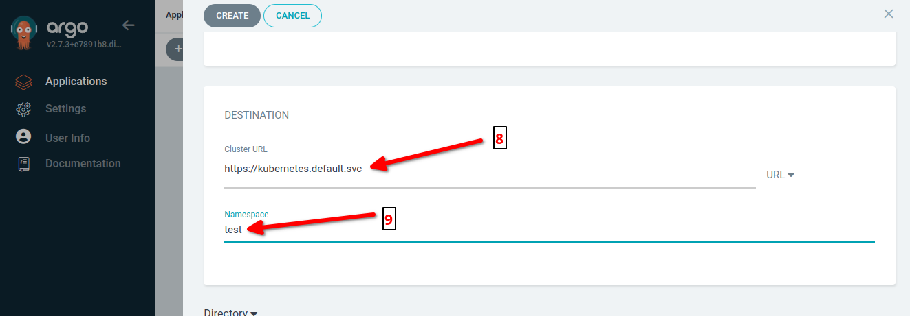

and create the project. After afew second your project will be created and here the output: 


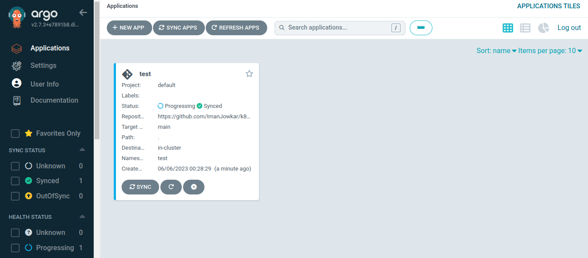

if your click the project you will see a nice visulization of your project


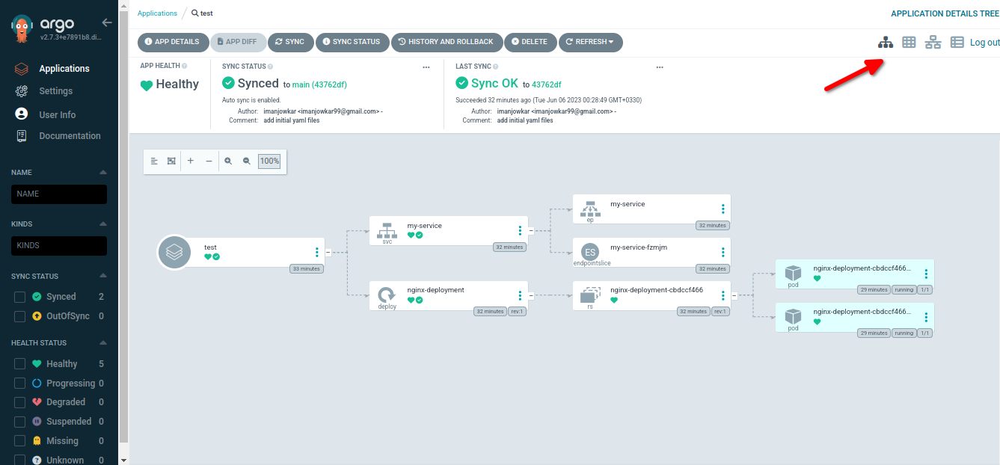

you can alse change the visualizations.


note that, argocd create a `test` namespace in your kubernetes cluster and deploy this project into this namespace: 

```
kubectl get ns

NAME                 STATUS   AGE
argocd               Active   125m
default              Active   4h33m
kube-node-lease      Active   4h33m
kube-public          Active   4h33m
kube-system          Active   4h33m
local-path-storage   Active   4h33m
test                 Active   4m29s


kubectl get all -n test
NAME                                   READY   STATUS    RESTARTS   AGE
pod/nginx-deployment-cbdccf466-6jnqx   1/1     Running   0          28m
pod/nginx-deployment-cbdccf466-hdbsv   1/1     Running   0          28m

NAME                 TYPE       CLUSTER-IP     EXTERNAL-IP   PORT(S)        AGE
service/my-service   NodePort   10.96.57.125   <none>        80:30457/TCP   31m

NAME                               READY   UP-TO-DATE   AVAILABLE   AGE
deployment.apps/nginx-deployment   2/2     2            2           31m

NAME                                         DESIRED   CURRENT   READY   AGE
replicaset.apps/nginx-deployment-cbdccf466   2         2         2       31m


```


## ArgoCD CLI

The ArgoCD CLI (Command-Line Interface) is a command-line tool that allows users to interact with ArgoCD and perform various operations from the command line. It provides a convenient way to manage applications, repositories, and other resources within ArgoCD.

With the ArgoCD CLI, you can perform actions such as:
* Deploying and managing applications in ArgoCD.
* Creating and updating application manifests.
* Syncing applications to ensure they match the desired state.
* Managing ArgoCD projects, repositories, and access controls.
* Viewing and managing application and deployment status.
* Accessing and managing ArgoCD settings and configurations.

The ArgoCD CLI is a powerful tool that complements the ArgoCD UI, offering flexibility and automation for managing ArgoCD resources. It can be installed separately on your local machine or used within containerized environments.

To use the ArgoCD CLI, you typically authenticate with the ArgoCD server, either using tokens or other authentication mechanisms, and then use the CLI commands to interact with the ArgoCD API.

The ArgoCD CLI is a useful tool for automating tasks, integrating with other tools and scripts, and incorporating ArgoCD into your workflows.


### Setup

go to the [docs](https://argo-cd.readthedocs.io/en/stable/cli_installation/) for installing ArgoCD-CLI
```
curl -sSL -o argocd-linux-amd64 https://github.com/argoproj/argo-cd/releases/latest/download/argocd-linux-amd64
sudo install -m 555 argocd-linux-amd64 /usr/local/bin/argocd
rm argocd-linux-amd64

```

```
argocd login IP_Node:Port_https

# in our case  you use self signed certificate, use below command for login:
argocd login IP_Node:Port_https --insecure

# run
argocd login 172.20.0.2:32700 --insecure
Username: admin
Password: <your password>
'admin:login' logged in successfully
Context '172.20.0.2:32700' updated


argocd cluster list

SERVER                          NAME        VERSION  STATUS      MESSAGE  PROJECT
https://kubernetes.default.svc  in-cluster  1.27     Successful

You can view the repositories that have already been added by using the following command.

argocd repo list
TYPE  NAME  REPO                                               INSECURE  OCI    LFS    CREDS  STATUS      MESSAGE  PROJECT
git         https://github.com/ImanJowkar/k8s-argocd-test.git  false     false  false  false  Successful           default


argocd app list
NAME         CLUSTER                         NAMESPACE  PROJECT  STATUS  HEALTH    SYNCPOLICY  CONDITIONS  REPO                                               PATH  TARGET
argocd/test  https://kubernetes.default.svc  test       default  Synced  Degraded  Auto        <none>      https://github.com/ImanJowkar/k8s-argocd-test.git  .     main


argocd app get my-app

argocd proj list


argocd logout IP_Node:Port_https


argocd account get-user-info
argocd account update-password

```

## conclusions

In conclusion, this post provided a comprehensive guide to working with ArgoCD, covering each step in detail. We started by introducing ArgoCD and highlighting its importance as a Kubernetes deployment tool.

We then delved into the installation process, beginning with setting up a Kubernetes cluster using Kind. This allowed readers to create a local cluster for testing and development purposes.

Next, we focused on installing ArgoCD on the Kubernetes cluster. We provided clear instructions and walked readers through the necessary commands to deploy ArgoCD components, such as the API server, the controller, and the user interface.

Once ArgoCD was successfully installed, we explored the process of adding a Git repository to ArgoCD. This enabled users to connect their application source code to ArgoCD and trigger automatic deployments upon changes in the repository.

Furthermore, we discussed how to create applications within ArgoCD, specifying the desired source repository, target cluster, and synchronization policy. This allowed readers to effectively manage and deploy their applications using ArgoCD's intuitive interface.

To enhance the experience and enable seamless command-line interaction, we covered the installation of the ArgoCD CLI. We explained how to install the CLI tool and provided examples of its usage for deploying and managing applications.

Finally, we concluded that by following the step-by-step instructions in this post, readers can harness the power of ArgoCD to simplify and automate their Kubernetes deployments. ArgoCD's user-friendly interface, coupled with the ability to integrate with Git repositories, streamlines the application deployment process, enabling efficient continuous delivery and enhancing overall development productivity.