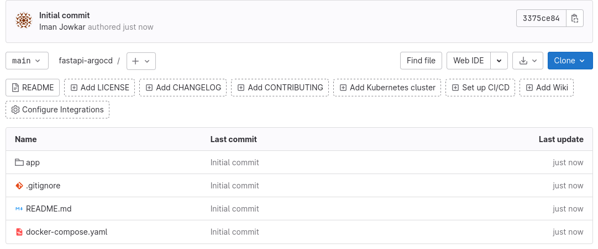

# Streamline Your Development Workflow with FastAPI, GitLab CI, and Argo CD

## Introduction

In today's fast-paced software development landscape, having efficient tools and processes is crucial. In this post, we'll explore the combination of FastAPI, GitLab CI, and Argo CD to create a streamlined development workflow that enables rapid iteration, automated testing, and seamless deployment.

first of all, let's introduce these three tools
## FastAPI

FastAPI is a modern, high-performance web framework for building APIs with Python. It offers a straightforward and intuitive way to develop web applications, leveraging the power of Python's type hints for automatic data validation and documentation generation. With its asynchronous capabilities, FastAPI ensures excellent performance, making it an ideal choice for building robust and scalable APIs.

## GitLab CI

GitLab CI is a powerful continuous integration and continuous delivery (CI/CD) platform integrated with GitLab. It enables teams to automate the testing and deployment of their applications by defining pipelines as code. With GitLab CI, you can define a series of stages and jobs to run various tasks, such as building, testing, and deploying your FastAPI application. This automation eliminates manual errors, reduces deployment time, and ensures consistent and reliable releases.

## Argo CD

Argo CD is a declarative, GitOps continuous delivery tool for Kubernetes. It enables you to define your application deployment configurations as YAML manifests and automatically syncs the desired state with the actual state of your Kubernetes cluster. By integrating Argo CD with GitLab CI, you can automate the deployment of your FastAPI application to a Kubernetes cluster. This allows for seamless rollbacks and easy management of multiple environments.

## Workflow Integration

To integrate FastAPI, GitLab CI, and Argo CD into your development workflow, follow these steps:

1. Set up a GitLab repository for your FastAPI application and configure GitLab CI to define your CI/CD pipeline.
2. Define stages and jobs in your GitLab CI configuration file to build, test, and package your FastAPI application.
3. Configure GitLab CI to push the packaged application artifacts to a container registry.
4. Set up an Argo CD instance and configure it to monitor your GitLab repository for changes.
5. Define the deployment configuration for your FastAPI application in Argo CD using YAML manifests.
6. Configure Argo CD to deploy your application to the target Kubernetes cluster whenever changes are detected in your GitLab repository.

## Benefits

By leveraging FastAPI, GitLab CI, and Argo CD together, you'll experience several benefits:

1. Faster development iterations: FastAPI's productivity and performance combined with automated testing and deployment accelerate the development cycle.
2. Improved reliability: GitLab CI's pipeline automation and Argo CD's GitOps approach ensure consistent and reliable deployments.
3. Scalability and flexibility: FastAPI's asynchronous capabilities and Kubernetes-based deployments enable scaling and handling high traffic loads effortlessly.
4. Easy management of multiple environments: Argo CD's declarative approach makes it simple to manage different environments, such as staging and production, with separate YAML manifests.

## Step1: Create a repository and push our code to this repo

go to gitlab.com and create a project, and push your codes to this repository. 
Ensure that your repository adheres to the following structure: 



I have cloned the project from this [repository](https://github.com/mongodb-developer/pymongo-fastapi-crud) and made some modifications to align it with our specific goals.

## Step2: Add Gitlab runner to your repository
bellow step add a gitlab runner to your repository

```

# Download the binary for your system
sudo curl -L --output /usr/local/bin/gitlab-runner https://gitlab-runner-downloads.s3.amazonaws.com/latest/binaries/gitlab-runner-linux-amd64

# Give it permission to execute
sudo chmod +x /usr/local/bin/gitlab-runner

# Create a GitLab Runner user
sudo useradd --comment 'GitLab Runner' --create-home gitlab-runner --shell /bin/bash

# Install and run as a service
sudo gitlab-runner install --user=gitlab-runner --working-directory=/home/gitlab-runner
sudo gitlab-runner start

sudo gitlab-runner register --url https://gitlab.com/ --registration-token <gitlab-token>

```